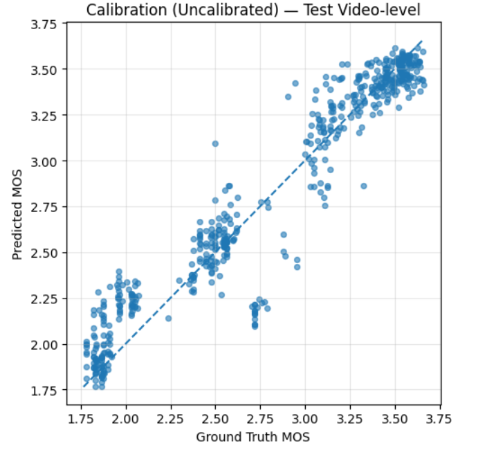
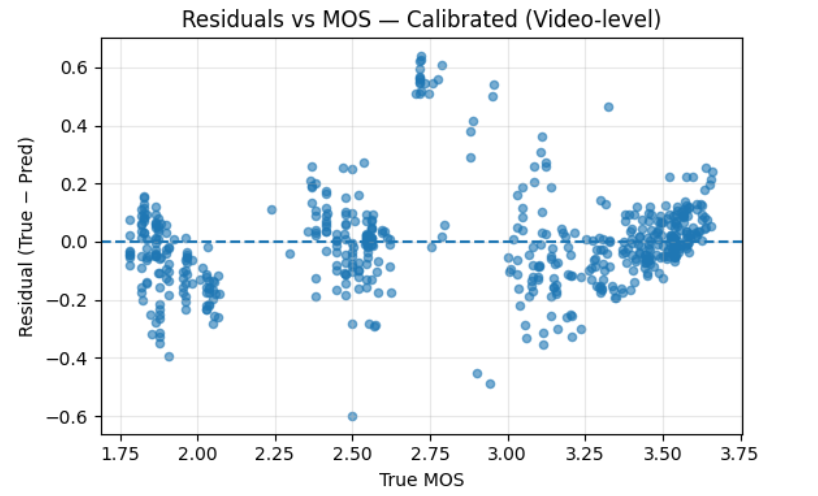

# EfficientNet-B3 CNN for Volumetric Video Quality Prediction (pMOS)

This repository contains a **convolutional neural network (CNN)** based on **EfficientNet-B3** for predicting perceptual quality scores of **volumetric video** content. The model is trained on **frame-level RGB data** extracted from compressed volumetric videos, using **predicted mean opinion scores (pMOS)** as continuous regression targets.

The approach is deliberately straightforward: predict quality per frame, then **aggregate at video level**. What matters here is reliability at the clip level, because subjective quality is not a single-frame phenomenon. The final model delivers robust performance on the held-out test set after combining **test-time augmentation (TTA)**, **10% trimmed-mean aggregation**, and a **validation-fitted linear calibration**. 

## Table of Contents

- [Abstract](#abstract)
- [Methodology](#methodology)
  - [Task Definition](#task-definition)
  - [Dataset and Splits](#dataset-and-splits)
  - [Model Architecture](#model-architecture)
- [Evaluation Protocol](#evaluation-protocol)
  - [Frame-level Inference](#frame-level-inference)
  - [Test-Time Augmentation (TTA)](#test-time-augmentation-tta)
  - [Video-level Aggregation (Trimmed Mean)](#video-level-aggregation-trimmed-mean)
  - [Metrics](#metrics)
  - [Calibration](#calibration)
- [Results](#results)
- [Figures](#figures)
- [95% Confidence Intervals (Bootstrapped)](#95-confidence-intervals-bootstrapped)

## Methodology

### Task Definition

The task is continuous quality prediction. For each input frame from a compressed volumetric video, the model outputs a scalar quality estimate aligned with subjective scores (pMOS). At evaluation time, frame-level predictions are aggregated to obtain clip-level/video-level quality.

All metrics are reported at both frame level and video level, with video-level performance taken as primary since subjective quality assessment is inherently clip-based. 

### Dataset and Splits

Frames are extracted from volumetric videos encoded with multiple:
- quantization parameters (QP),
- compression formats and combined compression settings,
- viewpoints and contents.

Each record contains:
- `frame_path`: path to the RGB frame,
- `pmos`: processed/predicted MOS label,
- `video_id`: identifier for video-level grouping.

Final dataset used for this model:
- **Train:** 35,744 frames  
- **Validation:** 4,472 frames  
- **Test:** 4,472 frames  

Train/validation/test splits are generated with a fixed random seed (**random_state = 42**) to ensure reproducibility and consistent comparison across runs and models. 

**Dataset summary**

| Split | Frames |
|---|---:|
| Train | 35,744 |
| Validation | 4,472 |
| Test | 4,472 |

### Model Architecture

- **Backbone:** EfficientNet-B3 (from `timm`)
- **Input:** 3-channel RGB, **300 × 300** (resize + crop)
- **Output head:** single linear unit for scalar regression
- **Loss:** Smooth L1 (Huber) loss for robust regression
- **Optimizer:** AdamW
- **Learning rate schedule:** warmup for first epochs, cosine decay afterwards
- **Regularization:** weight decay, data augmentation (random crops, flips, color jitter)
- An EMA implementation is available in the training code, but is **not enabled** in the final EfficientNet-B3 results reported here. 

## Evaluation Protocol

### Frame-level Inference
1) Apply normalization and geometric augmentations (for TTA where enabled).  
2) Predict a scalar quality score. 

### Test-Time Augmentation (TTA)

- Use TTA with **original + horizontal flip**.
- The frame-level prediction is the **average** of the two passes. 

### Video-level Aggregation (Trimmed Mean)

Video-level predictions are obtained through **10% symmetric trimmed mean**:
- remove the lowest 10% and highest 10% of frame predictions  
- average the remaining values  

Ground truth for each video is the mean of its frame-level pMOS values.

This approach reduces sensitivity to outlier frames and improves robustness. 

### Metrics

Both frame and video levels are evaluated with:
- Pearson Linear Correlation Coefficient (**PLCC**),
- Spearman Rank Correlation Coefficient (**SRCC**),
- Root Mean Squared Error (**RMSE**),
- Mean Absolute Error (**MAE**),
- Coefficient of determination (**R²**). 

### Calibration

A linear calibration function is fitted on validation video-level predictions:  
**y = a · ŷ + b**

With learned parameters:  
**ŷ\* = 1.0159 · ŷ − 0.0466**

This mapping is applied to test predictions.

Linear calibration preserves PLCC and SRCC but improves RMSE, MAE, and R². Per-subset calibration can further correct local biases introduced by encoder operating points. 

## Results

### Validation (TTA + trimmed, video-level)
- PLCC ≈ 0.953  
- SRCC ≈ 0.934  
- RMSE ≈ 0.196  
- MAE ≈ 0.138  
- R² ≈ 0.908 

### Test (TTA + trimmed, video-level, uncalibrated)
- PLCC ≈ 0.962  
- SRCC ≈ 0.937  
- RMSE ≈ 0.176  
- MAE ≈ 0.123  
- R² ≈ 0.923 

### Test (TTA + trimmed, video-level, calibrated)
After applying the linear mapping learned on the validation set:
- PLCC ≈ 0.962  
- SRCC ≈ 0.937  
- RMSE ≈ 0.175  
- MAE ≈ 0.121  
- R² ≈ 0.923–0.9235 

### Overall Performance (video-level)

| Setting | PLCC | SRCC | RMSE | MAE | R² |
|---|---:|---:|---:|---:|---:|
| Uncalibrated (TTA + trimmed) | 0.9616 | 0.9374 | 0.1759 | 0.1226 | 0.9228 |
| Globally calibrated | 0.9616 | 0.9374 | 0.1751 | 0.1209 | 0.9235 |
| Per-subset calibrated (compression × QP) | 0.9659 | 0.9471 | 0.1651 | 0.1128 | 0.9320 |

## Figures

### Figure 1. Calibration (Uncalibrated)
Test video-level predictions vs. ground truth MOS (EfficientNet-B3, TTA + trimmed). 

### Figure 2. Calibration (Calibrated)
Test video-level predictions after linear mapping. Dashed line: ideal y = x. 

### Figure 3. Residuals vs MOS (Calibrated)
Residuals defined as: (True MOS − Predicted MOS). 

### Figure 4. PLCC by QP (Test, video-level)
Per-QP analysis indicates high PLCC/SRCC at QP 25–45 and a noticeable drop in PLCC at QP=15 due to limited score variance at near-perfect quality. 

### Figure 5. Grad-CAM examples
Grad-CAM heatmaps show the model focusing on human figures, edges, textured surfaces, and structurally salient regions, while suppressing background and flat areas. 

## 95% Confidence Intervals (Bootstrapped)

Bootstrapped 95% confidence intervals on test video-level PLCC, SRCC and R² confirm that the observed performance is statistically stable, with all intervals remaining in the high-performance regime.

Uncalibrated (Test, video-level):
- PLCC ≈ 0.962 (95% CI: 0.953 – 0.970)
- SRCC ≈ 0.937 (95% CI: 0.925 – 0.948)
- R² ≈ 0.923 (95% CI: 0.906 – 0.936)

Calibrated (Test, video-level):
- PLCC ≈ 0.962 (95% CI: 0.953 – 0.970)
- SRCC ≈ 0.937 (95% CI: 0.925 – 0.948)
- R² ≈ 0.923 (95% CI: 0.906 – 0.938) 

